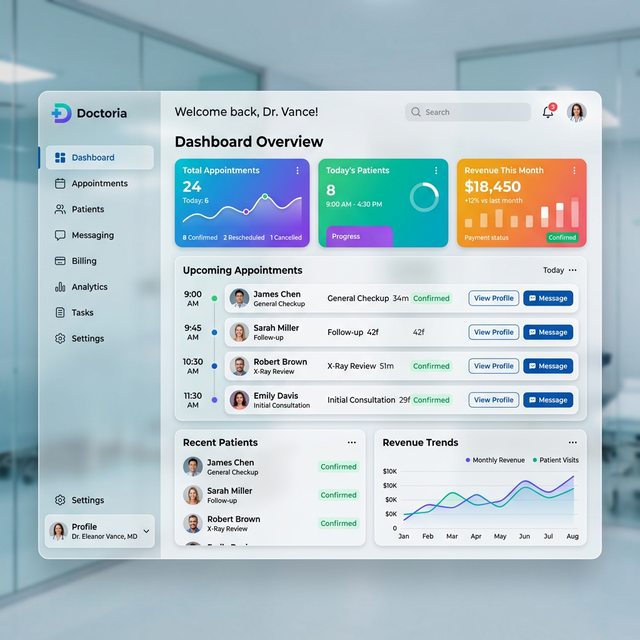
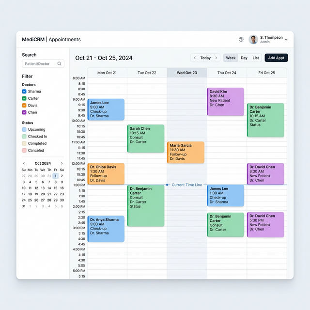
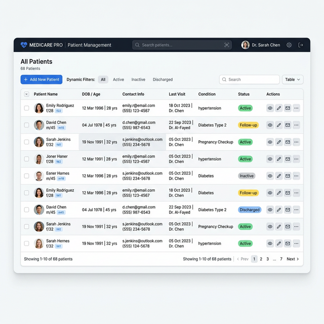
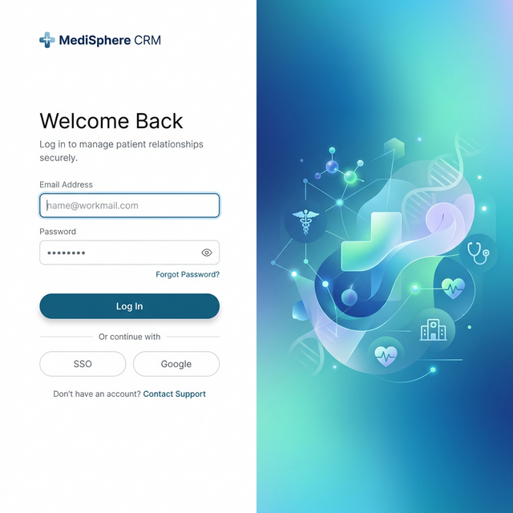

<div align="center">
  <h1>🩺 Doctoria CRM & Calendar</h1>
  <p><strong>A Modern, Comprehensive Medical Practice Management Solution | Una solución moderna e integral para la gestión de clínicas médicas</strong></p>
  
  [](https://opensource.org/licenses/MIT)
  [](#)
  [](#)
</div>

<br />

> 🌍 [Read in English](#english-version) | [Leer en Español](#versión-en-español)

---

<h2 id="english-version">🇬🇧 English Version</h2>

Welcome to **Doctoria CRM & Calendar**, a fully-featured, elegant web-based application built to streamline operations for medical clinics, doctors, and healthcare professionals. The system facilitates patient management, secure communication, real-time appointment scheduling, and much more, all through a responsive, state-of-the-art user interface.

### 🌟 Key Features

*   📅 **Smart Calendar Integration:** Visual, drag-and-drop capabilities for effortless schedule coordination.
*   👥 **Comprehensive Patient Management:** Real-time patient overview, clinical histories, and status tracking.
*   📊 **Executive Dashboard & Analytics:** Understand your clinic's performance with deep metrics and revenue analytics.
*   🔐 **Secure Access & Auth:** Role-based access control protecting PII and sensitive medical data.
*   💬 **Integrated Messaging:** Internal messaging and patient communication modules.

### 📸 Software Previews

We believe in empowering medical staff through beautiful, frictionless design. Here's a look at our refined interfaces:

**Executive Dashboard**
<div align="center">
  
</div>

**Calendar & Scheduling**
<div align="center">
  
</div>

**Patient Management Center**
<div align="center">
  
</div>

**Secure Authentication System**
<div align="center">
  
</div>

### 🚀 Getting Started (Installation Guide)

#### Prerequisites
- **PHP** 8.0 or higher
- **MySQL** or MariaDB
- A local server environment: **AMPPS** or **XAMPP**

#### 🍎 macOS Installation (using AMPPS or XAMPP)
1. **Install Server:** Download and install [AMPPS for Mac](https://ampps.com/downloads/) or [XAMPP for Mac](https://www.apachefriends.org/download.html).
2. **Clone the repository:** 
   Open your Terminal and run:
   ```bash
   # For AMPPS:
   cd /Applications/AMPPS/www/
   # For XAMPP:
   # cd /Applications/XAMPP/xamppfiles/htdocs/
   
   git clone https://github.com/D3C0D1/Software-CRM-Doctoria-Calendar.git
   ```
3. **Database Setup:**
   - Open phpMyAdmin (usually `http://localhost/phpmyadmin`).
   - Create a new database named `crm_doctoria`.
   - Import the `setup.sql` file provided in the repository into the new database.
4. **Run the Application:** Start the Apache and MySQL services in your AMPPS/XAMPP control panel and navigate to `http://localhost/Software-CRM-Doctoria-Calendar/` in your browser.

#### 🪟 Windows Installation (using AMPPS or XAMPP)
1. **Install Server:** Download and install [AMPPS for Windows](https://ampps.com/downloads/) or [XAMPP for Windows](https://www.apachefriends.org/download.html).
2. **Clone the repository:** 
   Open Command Prompt or Git Bash and run:
   ```cmd
   # For AMPPS (typically):
   cd C:\Program Files\Ampps\www\
   # For XAMPP (typically):
   # cd C:\xampp\htdocs\
   
   git clone https://github.com/D3C0D1/Software-CRM-Doctoria-Calendar.git
   ```
3. **Database Setup:**
   - Open phpMyAdmin via your browser (usually `http://localhost/phpmyadmin`).
   - Create a new database named `crm_doctoria`.
   - Import the `setup.sql` file.
4. **Run the Application:** Ensure Apache and MySQL are running in the control panel. Open your browser and go to `http://localhost/Software-CRM-Doctoria-Calendar/`.

---

<h2 id="versión-en-español">🇪🇸 Versión en Español</h2>

Bienvenido a **Doctoria CRM & Calendar**, una aplicación web elegante, con todas las funciones necesarias, construida para optimizar las operaciones de clínicas médicas, doctores y profesionales de la salud. El sistema facilita la gestión de pacientes, comunicación segura, programación de citas en tiempo real y mucho más, todo a través de una interfaz de usuario moderna y responsiva.

### 🌟 Características Principales

*   📅 **Integración de Calendario Inteligente:** Capacidades visuales con *drag-and-drop* para una coordinación de horarios sin esfuerzo.
*   👥 **Gestión Integral de Pacientes:** Resumen de pacientes en tiempo real, historias clínicas y seguimiento de estados.
*   📊 **Panel de Control (Dashboard) y Analíticas:** Comprende el rendimiento de tu clínica con métricas profundas y análisis de ingresos.
*   🔐 **Acceso Seguro y Autenticación:** Control de acceso basado en roles que protege la información personal y datos médicos sensibles.
*   💬 **Mensajería Integrada:** Módulos de mensajería interna y comunicación con pacientes.

### 📸 Vistas Previas del Software

Creemos en empoderar al personal médico a través de un diseño hermoso y sin fricciones. Aquí tienes un vistazo a nuestras refinadas interfaces:

**Panel de Control Ejecutivo** *(Las imágenes se muestran igual que en la versión en inglés)*
<div align="center">
  
</div>

**Calendario y Programación**
<div align="center">
  
</div>

**Centro de Gestión de Pacientes**
<div align="center">
  
</div>

**Sistema de Autenticación Segura**
<div align="center">
  
</div>

### 🚀 Guía de Instalación y Primeros Pasos

#### Requisitos Previos
- **PHP** 8.0 o superior
- **MySQL** o MariaDB
- Entorno de servidor local: **AMPPS** o **XAMPP**

#### 🍎 Instalación en macOS (usando AMPPS o XAMPP)
1. **Instalar Servidor:** Descarga e instala [AMPPS para Mac](https://ampps.com/downloads/) o [XAMPP para Mac](https://www.apachefriends.org/download.html).
2. **Clonar el repositorio:** 
   Abre la Terminal y ejecuta:
   ```bash
   # Para AMPPS:
   cd /Applications/AMPPS/www/
   # Para XAMPP:
   # cd /Applications/XAMPP/xamppfiles/htdocs/
   
   git clone https://github.com/D3C0D1/Software-CRM-Doctoria-Calendar.git
   ```
3. **Configuración de Base de Datos:**
   - Abre phpMyAdmin (generalmente `http://localhost/phpmyadmin`).
   - Crea una nueva base de datos llamada `crm_doctoria`.
   - Importa el archivo `setup.sql` proporcionado en el repositorio dentro de la nueva base de datos.
4. **Ejecutar la Aplicación:** Inicia los servicios de Apache y MySQL en el panel de control (AMPPS/XAMPP) y navega a `http://localhost/Software-CRM-Doctoria-Calendar/` en tu navegador.

#### 🪟 Instalación en Windows (usando AMPPS o XAMPP)
1. **Instalar Servidor:** Descarga e instala [AMPPS para Windows](https://ampps.com/downloads/) o [XAMPP para Windows](https://www.apachefriends.org/download.html).
2. **Clonar el repositorio:** 
   Abre el Símbolo del Sistema (Command Prompt) o Git Bash y ejecuta:
   ```cmd
   # Para AMPPS (típicamente):
   cd C:\Program Files\Ampps\www\
   # Para XAMPP (típicamente):
   # cd C:\xampp\htdocs\
   
   git clone https://github.com/D3C0D1/Software-CRM-Doctoria-Calendar.git
   ```
3. **Configuración de Base de Datos:**
   - Abre phpMyAdmin desde el navegador (generalmente `http://localhost/phpmyadmin`).
   - Crea una nueva base de datos llamada `crm_doctoria`.
   - Importa el archivo `setup.sql`.
4. **Ejecutar la Aplicación:** Asegúrate de que Apache y MySQL estén corriendo en el panel de control. Abre tu navegador y ve a `http://localhost/Software-CRM-Doctoria-Calendar/`.

---

## 🗂 Project Structure / Estructura del Proyecto

```text
Software-CRM-Doctoria-Calendar/
├── app/                  # Core application logic & MVC controllers
├── config/               # Database and system configuration files
├── css/                  # Styling, theme, and UI framework files
├── img/                  # Assets and screenshot resources
├── js/                   # Interactive scripts and DOM manipulations
├── index.php             # Main entry point 
├── setup.sql             # Database schema & migrations
└── ...
```

## 📊 Recent Verifications & Reports / Verificaciones y Reportes Recientes

- **Latest Session Memory / Memoria de Sesión Reciente**: [session-2026-07-13-mcp-login-fixes.md](file:///lamp/www/naxielly/docs/memories/session-2026-07-13-mcp-login-fixes.md)
- **Verification Report / Reporte de Verificación MD**: [2026-07-13-mcp-login-fixes-verification.md](file:///lamp/www/naxielly/docs/reports/2026-07-13-mcp-login-fixes-verification.md)
- **Interactive Verification Report / Reporte Interactivo HTML**: [2026-07-13-mcp-login-fixes-verification.html](file:///lamp/www/naxielly/docs/reports/2026-07-13-mcp-login-fixes-verification.html)

## 📄 License / Licencia

Distributed under the MIT License. See `LICENSE` for more information. / Distribuido bajo la Licencia MIT. Consulta el archivo `LICENSE` para más detalles.

---
*Built with ❤️ by [D3C0D1](https://github.com/D3C0D1) & Team.*
